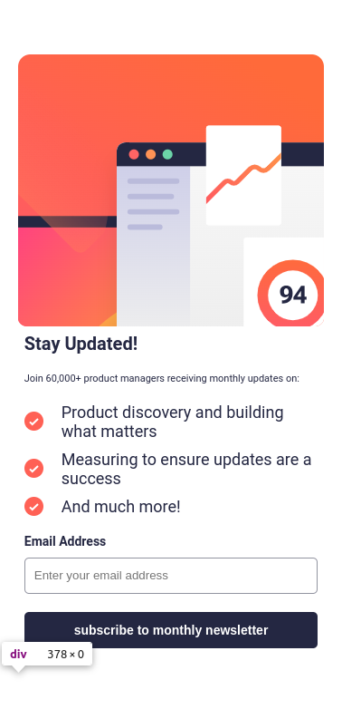

# Frontend Mentor - Newsletter sign-up form with success message solution

This is a solution to the [Newsletter sign-up form with success message challenge on Frontend Mentor](https://www.frontendmentor.io/challenges/newsletter-signup-form-with-success-message-3FC1AZbNrv). Frontend Mentor challenges help you improve your coding skills by building realistic projects.

## Table of contents

- [Overview](#overview)
  - [The challenge](#the-challenge)
  - [Screenshot](#screenshot)
  - [Links](#links)
- [My process](#my-process)
  - [Built with](#built-with)
  - [Continued development](#continued-development)
- [Author](#author)

## Overview

### The challenge

Users should be able to:

- Add their email and submit the form
- See a success message with their email after successfully submitting the form
- See form validation messages if:
  - The field is left empty
  - The email address is not formatted correctly
- View the optimal layout for the interface depending on their device's screen size
- See hover and focus states for all interactive elements on the page

### Screenshot



### Links

- Solution URL: [frontend mentor solution](https://www.frontendmentor.io/solutions/newsletter-signup-with-success-message-EKbvwioz-Y)
- Live Site URL: [vercel deployment](https://frontendmentor-newsletter-two.vercel.app/)

## My process

### Built with

- Semantic HTML5 markup
- CSS custom properties
- Flexbox
- Typescript
- Mobile-first workflow
- [Vue.JS](https://vuejs.org/) - JS framework

### What I learned

```js
<script setup lang="ts">
import ListIcon from "@/assets/images/icon-list.svg";
type Props = {
  email: string;
  error: boolean;
};

defineProps<Props>();
</script>

<template>
  <div class="newsletter-email">
    <h1>stay updated!</h1>
    <p>Join 60,000+ product managers receiving monthly updates on:</p>
    <ul>
      <li>
        Product discovery and building
        what matters
      </li>
      <li>
        Measuring to ensure updates are a
        success
      </li>
      <li>And much more!</li>
    </ul>
    <div class="control">
      <div class="label">
        <label for="email">Email Address</label>
        <span v-if="error">Valid email is required</span>
      </div>
      <input
        type="email"
        name="email"
        id="email"
        :value="email"
        @input="
          $emit('update:email', ($event.target as HTMLInputElement).value)
        "
        placeholder="Enter your email address"
        :class="{ error: error }"
      />
      <button @click="$emit('submit')">subscribe to monthly newsletter</button>
    </div>
  </div>
</template>
<style lang="css" scoped>
.newsletter-email {
  padding: 2%;
  h1 {
    font-size: clamp(2rem, 5vw, 4rem);
    font-weight: 700;
    color: var(--dark-slate-grey);
    text-transform: capitalize;
    margin-bottom: 2rem;
  }
  p {
    color: var(--dark-slate-grey);
    font-size: 1.1rem;
    font-weight: 400;
    margin-bottom: 2rem;
  }
  ul {
    display: flex;
    flex-direction: column;
    margin-bottom: 2rem;
  }
  li {
    color: var(--dark-slate-grey);
    display: flex;
    align-items: center;
    font-size: clamp(1.6rem, 5vw, 1.8rem);
    gap: 2rem;
    &:is(:not(:last-child)) {
      margin-bottom: 1rem;
    }
  }
  .label {
    display: flex;
    justify-content: space-between;
    align-items: center;
    margin-bottom: 1rem;
  }
  span {
    color: rgb(217, 85, 85);
    font-size: 1.2rem;
    font-weight: 400;
  }
  .control {
    display: flex;
    flex-direction: column;
  }
  label {
    color: var(--dark-slate-grey);
    font-size: 1.4rem;
    font-weight: 700;
  }
  input {
    width: 100%;
    height: 4rem;
    border-radius: 5px;
    border: 1px solid var(--grey);
    padding: 1rem;
    color: var(--charcoal-grey);
    margin-bottom: 1rem;
    transition-property: background-color, color, border-color;
    transition-duration: 0.3s;
    transition-timing-function: ease-in-out;
    &:focus {
      outline: none;
      border-color: var(--dark-slate-grey);
    }
    &.error {
      border-color: rgb(217, 85, 85);
      color: rgb(217, 85, 85);
      background-color: #f3c5c0;
    }
  }
  button {
    width: 100%;
    height: 4rem;
    background-color: var(--dark-slate-grey);
    border-radius: 5px;
    color: var(--white);
    font-size: 1.4rem;
    font-weight: 700;
    transition: background 0.3s ease-in-out;
    border: none;
    &:hover {
      cursor: pointer;
      background: rgb(217, 85, 85);
      background: linear-gradient(
        90deg,
        rgba(217, 85, 85, 1) 55%,
        rgba(255, 21, 0, 1) 100%
      );
    }
  }
}
@media screen and (min-width: 768px) {
  .newsletter-email {
    padding: 8% 4%;
    flex-basis: 50%;
    display: flex;
    gap: 2rem;
    flex-direction: column;
  }
  li {
    &:is(:not(:last-child)) {
      margin-bottom: 2rem;
    }
  }
}
button {
  margin-top: 1rem;
}
</style>

```

### Continued development

still learning how to make webp apps using `Vue` and its ecosystem and I will add more solutions with another `JS` libraries&frameworks such as `Svelte`, `Solid` and `React`.

## Author

- Website - [my portfolio](https://abdelmonaem-portfolio.vercel.app/)
- Frontend Mentor - [@coder-abdo](https://www.frontendmentor.io/profile/coder-abdo)
- LinkedIn - [follow me on LinkedIn](https://www.linkedin.com/in/abdelmonaem-shahat/)
